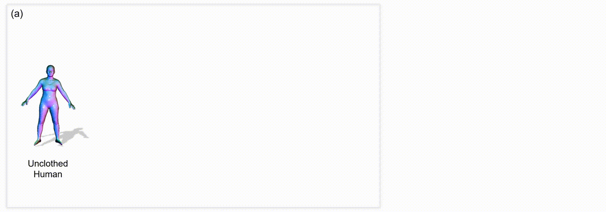

<div align="center">

# FreeCloth: Free-form Generation Enhances Challenging Clothed Human Modeling
  
<a href="https://alvinyh.github.io/">Hang Ye</a>,
<a href="https://shirleymaxx.github.io/">Xiaoxuan Ma</a>,
<a href="https://haici.cc/">Hai Ci</a>,
<a href="https://wentao.live/">Wentao Zhu</a>,
<a href="https://cfcs.pku.edu.cn/english/people/faculty/yizhouwang/index.htm">Yizhou Wang</a>

Peking University

<p align="center">
<a href="https://alvinyh.github.io/FreeCloth/", target="_blank">
</a>
<a href="https://www.youtube.com/watch?v=y9hM925p3_0", target="_blank">
</a>
</p>
</div>

<p align="center">
  
</p>

## Updates
[2024/12/01] Code released!

## TODOs
- [ ] Provide pre-processing code for extracting clothing-cut maps.

## Installation

1. This project is developed using python 3.9 on Ubuntu 20.04. NVIDIA GPUs are needed. We recommend you to create an [Anaconda](https://www.anaconda.com/) virtual environment.
```
conda create -n freecloth python=3.9
conda activate freecloth
```

2. Install [PyTorch](https://pytorch.org/) following the official instructions. We have tested our code on torch1.12.1+cu113, but other versions should also work fine. Also install other torch-related packages: [PyTorch Lightning](https://lightning.ai/docs/pytorch/stable/), [PyTorch3D](https://pytorch3d.org/) and [kaolin](https://kaolin.readthedocs.io/en/latest/notes/installation.html). 
```
pip install torch==1.12.1+cu113 torchvision==0.13.1+cu113 --extra-index-url https://download.pytorch.org/whl/cu113
pip install pytorch-lightning==1.8.0 torch==1.12.1+cu113
pip install fvcore
pip install --no-index pytorch3d -f https://dl.fbaipublicfiles.com/pytorch3d/packaging/wheels/py39_cu113_pyt1121/download.html
pip install kaolin==0.13.0 -f https://nvidia-kaolin.s3.us-east-2.amazonaws.com/torch-1.12.1_cu113.html
```

3. Pull our code.
```
git clone https://github.com/AlvinYH/FreeCloth.git
cd FreeCloth
```

4. Install other dependencies.
```
sh scripts/requirements.sh
```

5. Download SMPL-X models from the [official website](https://smpl-x.is.tue.mpg.de/download.php). We use the `SMPL-X v1.1 (NPZ+PKL)` model. After downloading, specify the path to the SMPL-X models in `smpl.model_path` in the config file `config/config.yaml`.

6. Download data following the [Data](#data) section. In summary, your directory tree should be like this

  ```
    ${Project}
    ├── assets
    ├── chamferdist
    ├── config
    ├── data 
    ├── lib 
    ├── outputs
    ├── pointnet2_ops_lib
    ├── main.py
    ├── README.md
    |── requirements.txt
  ```


## Train & Eval

### Data

Download the [ReSynth](https://pop.is.tue.mpg.de/) dataset from the official link. Our experiments focus on 5 subjects with loose clothing. Their IDs are specified in `config/resynth_subject_list.yaml`. For convenience, we provide a script to download the dataset automatically. You'll need to input the username and password for your registered account:

```bash
sh scripts/download_resynth.sh
```

We preprocess the training data to compute the **clothing-cut maps**, as described in the paper. You can download our preprocessed results, including per-subject SMPL face masks and canonical body templates, from the following links ([Google drive](https://drive.google.com/file/d/1gsOY_qNWKW8PZMkUvjv7LLwPCSDlYNNz/view?usp=sharing) or [Onedrive](https://1drv.ms/u/s!AvsgE1s8iH21gk-QJU3FZ_EYWJtc?e=Cw1uZ7)). Unzip `resynth_helper.tar.gz` into the `data/resynth` directory. The `data` directory structure should follow the below hierarchy. 

```
${Project}
|-- data
    |-- resynth
    |   |-- minimal_body_shape
    |   |-- rp_anna_posed_001
    |   |   |-- test
    |   |   |-- train
    |   |-- ...
    |   |-- rp_janett_posed_025
    |   |   |-- test
    |   |   |-- train
    |   |-- cut_map.pkl
    |   |-- faces_mask.pkl
```

### Train

Each experiment is defined by a configuration file (`config/config.yaml`). To train the model, run the following script:
```bash
python main.py expname=$exp_name datamodule.subject_id=$subject_id
```

- Results (checkpoints, logs, visualizations, etc.) will be saved in the directory `outputs/resynth/$exp_name`.
- Specify the subject ID (e.g., rp_janett_posed_025). Note that the current code only supports single-subject modeling.
- Adjust the number of generated points as needed for your subject. For example, increase the value of  `model.generator.num_points` to 32768 for long dresses (rp_felice_posed_004).


### Evaluation

To evaluate the model, set the argument `mode=test`:

```bash
python main.py expname=$exp_name mode=test datamodule.subject_id=$subject_id
```

- By default, Open3D visualization is enabled (`vis.enabled=True`), allowing you to check the predicted point cloud in `pc_dir` and the rendered normal image in `vis_dir`. 
- Additionally, quantitative metrics are logged in `metric_test.txt`.
- For improved visual quality and uniform point distribution, you can enable point resampling by setting `datamodule.params.uv_resample=True`. However, this increases inference time.

### Pretrained Models
We provide pretrained model weights for five subjects from the ReSynth dataset. You can download them from [Google drive](https://drive.google.com/file/d/1T-tdRPLFct6MOxZvc4Khf3fStmSYMvOP/view?usp=sharing) or [Onedrive](https://1drv.ms/u/s!AvsgE1s8iH21glCwF-SKjL8KM5TC?e=by5vTU). After downloading, extract the models to the `outputs/resynth` directory for evaluation.


## Results
<p align="middle">
   
  
   
   
</p>

## Citation
Cite as below if you find this repository is helpful to your project:
```bibtex
```

## Acknowledgement
This repo is built on the excellent work [SNARF](https://github.com/xuchen-ethz/snarf), [POP](https://github.com/qianlim/POP) and [SpareNet](https://github.com/microsoft/SpareNet). Thanks for these great projects.